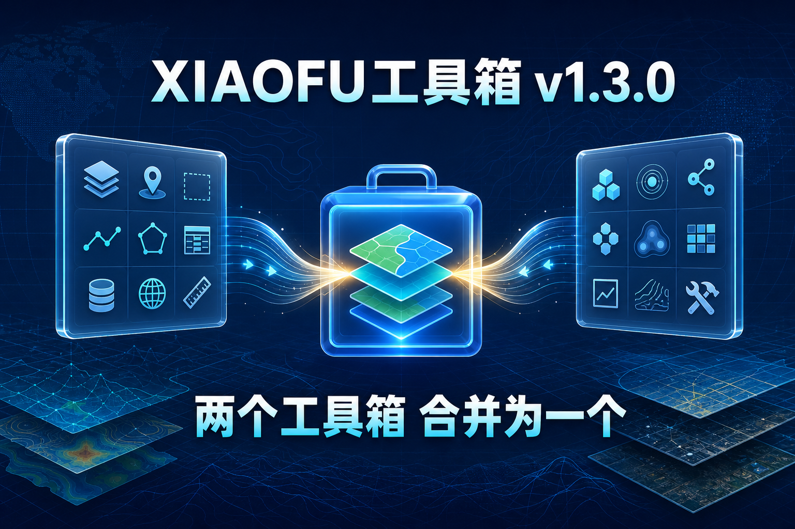
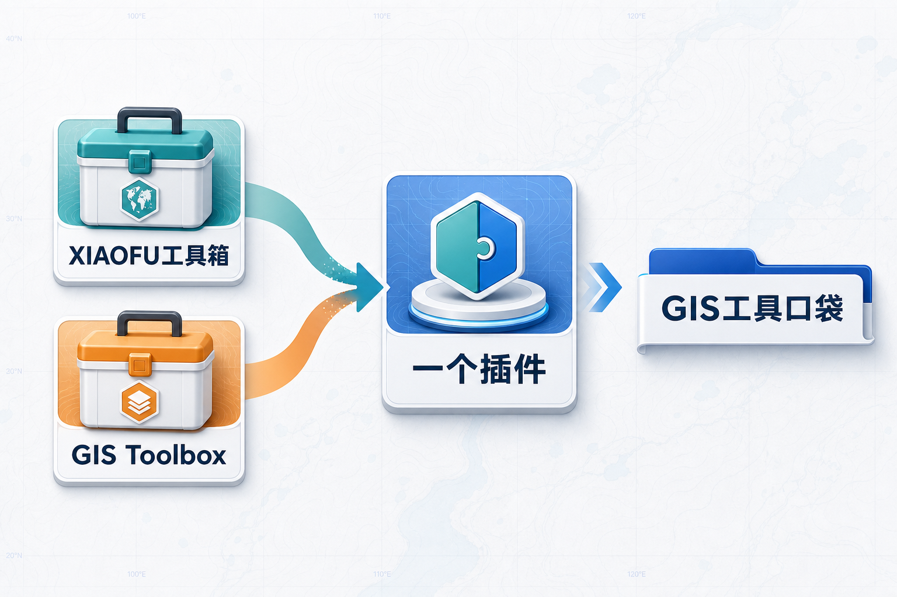
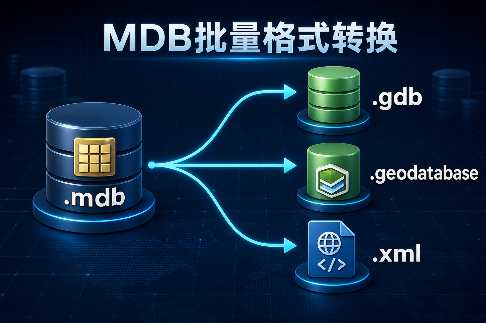

# XIAOFU工具箱 v1.3.0 更新发布｜两个工具箱合一，MDB 转换与运行体验全面优化

这次更新，XIAOFU工具箱完成了一项重要整合：原来需要分别安装的 **XIAOFU工具箱** 和 **GIS Toolbox**，现在合并为同一个 ArcGIS Pro 插件。

升级后，只需安装一个 `XIAOFUTools.esriAddinX`，即可继续使用原有的 GIS 数据处理、分析检查、制图输出工具，以及原 GIS Toolbox 的工具收纳与调用能力。

不用在两个插件之间切换，也不需要维护两份安装包。

## 两个工具箱，现在安装一个就够了

原 XIAOFU工具箱保留通用、编辑、数据、制图、系统等常用工具入口；原 GIS Toolbox 则以独立的 **GIS 工具口袋** 标签页整合到同一个插件中。

升级后有两个清晰入口：

- **XIAOFU工具箱**：继续使用已有的数据处理、分析检查、制图输出和系统工具。
- **GIS 工具口袋**：集中收纳自己常用的工具箱、内置命令、地图工具和自定义工具组。

GIS 工具口袋保留工具箱结构树、搜索、排序、隐藏、动态 Ribbon 入口，以及完整工具包导入导出等能力。原 GIS Toolbox 用户也无需重新配置：首次未发现新配置时，工具会兼容读取原有配置。

如果当前不需要此标签页，可进入 **XIAOFU工具箱 → 系统 → 设置**，通过“显示 GIS 工具口袋标签页”随时打开或关闭。

## MDB批量格式转换：三种输出格式，更直接

`MDB批量格式转换` 已升级为调用 ArcGIS Pro 3.7 自带的 **Convert Personal Geodatabase** 转换工具，不再使用旧的自制转换链路。

现在可按实际交付需要，将 Personal Geodatabase 的 `.mdb` 数据批量转换为：

- **文件地理数据库**：`.gdb`
- **移动地理数据库**：`.geodatabase`
- **XML Workspace Document**：`.xml`

工具仍保留批量扫描、选择转换项、输出位置规划、覆盖控制、停止取消和必要操作日志。转换过程直接使用 ArcGIS Pro 的原生能力，输出类型与软件内置工具保持一致。

## 常用操作更流畅

本次还集中优化了多项数据处理任务的运行体验。

- 耗时的地理处理任务尽量在后台执行，减少处理过程中对界面操作的影响。
- 常用数据扫描、数据库刷新等操作减少同步等待，打开和刷新更轻快。
- 图幅与数据库相关批量任务完善资源释放，降低操作完成后数据仍被占用的情况。
- 正式工具移除开发期自检和临时数据创建流程，日志只保留转换、处理、警告、错误和完成等关键信息。

## 本次同步更新

- 驱动制图增加交集表格设置、面积调平、布局表格生成和批量导出联动。
- 优化极小“其他”交集面积处理，避免产生无意义表格行。
- 修复 KML/KMZ 标注字段下拉框鼠标展开及字段刷新后选择被重置的问题。
- AI 助手不再保留内置默认 API、密钥和模型；升级时会清理旧内置配置，同时保留用户自定义模型。

## 如何升级

下载并安装最新版 `XIAOFUTools.esriAddinX`，安装后重启 ArcGIS Pro 即可。

若电脑上此前同时安装旧版 XIAOFU工具箱和 GIS Toolbox，升级到 v1.3.0 后以新版 XIAOFUTools 为准，不再需要额外安装 GIS Toolbox。

仅支持 **ArcGIS Pro 3.7**。

## 获取方式

关注公众号，回复「XIAOFU工具箱」获取下载链接。

---

**XIAOFU工具箱 v1.3.0**

一个插件整合两套工具能力，让常用 GIS 工具更集中，MDB 数据迁移更直接，日常操作也更流畅。
